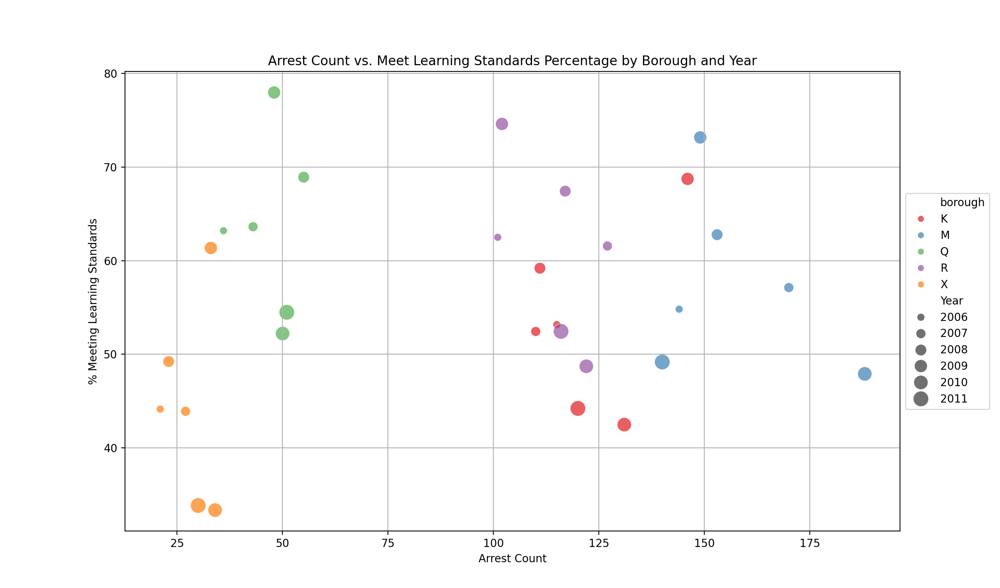
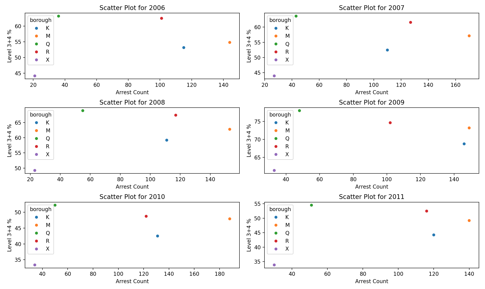

# NYC_Education_Crime_Analysis

## Table of Contents
- [Introduction](#introduction)
- [Datasets Description](#datasets-description)
- [Data Preparation & Join](#data-preparation-and-join)
- [Project Structure](#project-structure)
- [Prerequisites](#prerequisites)
- [Usage](#usage)
- [Results](#results)

## Introduction
This project aims to visualize two distinct large datasets regarding education level and crime in New York City. The goal is to find out if there is any correlation between education level and crime rate in different boroughs and different years in NYC. If such a correlation exists, it might be concluded that education has been edffective in reducing crime rates, and I have to make best use of it for regions that lack sufficient hgih-quality educational system. If there is no specific between crime rate and education indifferent regions, one can conclude that education has not been effective enough to make the community aware of the consequences of crimes. Therefore, probably new methods are requrired to be adapted in the educational system of the New York City.

## Datasets Description
Two datasets have been used in this project:

### The NYPD Arrests Data (Historic):
You can download this dataset via the following link:  
https://data.cityofnewyork.us/Public-Safety/NYPD-Arrests-Data-Historic-/8h9b-rp9u  
This dataset is a extremely large set of arrest cases recorded in New York City. Each record, has several attributes, but the following ones are important in this experiment:  
**Latitude, Longitude, ARREST_DATE**      
**Latitude, Longitude**: Two floating point numbers that represent the coordinate in which the arrest action took place.
**ARREST_DATE**: the exact date of the arrest case reported in the following format: MM/DD/YYYY

### The ELA Test Results by Grade - School level - by Race-Ethnicity
You can download this dataset via the following link:  
https://data.cityofnewyork.us/Education/2006-2011-English-Language-Arts-ELA-Test-Results-b/g8e6-y4ax  
This dataset is a large set of New York City Results on the New York State English Language Arts (ELA) Tests, for grades 3 - 8. Each record, has several attributes, but the following ones are important in this experiment:  
**DBN, Year, Level 3+4 %**    
**DBN**: Every school in New York City has a distinct DBN (District Borough Number), and it refers to that.
**Year**: The year which the ELA test took place.
**Level 3+4 %**: Students taking ELA test may score in level 1, 2, 3, or 4. If they score in level 3, it means they meet the learning standards. In case of scoring in level 4, it has the meaning of meeting learning standards in distinction. For a spcific DBN, Level 3+4 basically means the total number of cases that scored in either level 3 or 4. Finally, Level 3+4 % means the proportion of test takes in a specific DBN that score in level 3 or 4. It basically means what percentage of students in a DBN (school) meet the learning standards.

## Data Preparation and Join
I want to join the two dataset based on distinc values for pair of Year and Borough so that finally I will have the following attributes:  
**Borough, Year, Arrest Count, % Meeting Learning Standards**  
However, obtaining appropriate values for htese attributes requires several data preprocessing steps because the two dataset attributes in their raw format cannot be merged properly and meaningfully. Here the most important data preprocessing steps in this experiment have been mentioned:  
1. For Arrest dataset, there is a column "ARREST_DATE" and it has the format "MM/DD/YYYY". Thefore, I can easily convert it to a new attribute called Year by considering only the "YYYY".  
2. For Arrest dataset, there a pair of Latitude and Longitude for each record. I have provided a method "Find_Borough" that gets a pair of (Latitude, Longitude) and computes what borough this coordinate belongs to. This has been implemented by considering approximate polygon boundaries for each borough.  
3. For ELA dataset, each record has a DBN that refers to a unique school. I need the corresponding borough for that school, and that can be obtained by extracting the third character of a DBN. Here is how wach borough in NYC has been abbreviated:  
    * K: Brooklyn (Kings County)
    * M: Manhattan
    * Q: Queens
    * R: The Bronx (originally "B" for Bronx, but "R" was chosen to avoid confusion with Brooklyn)
    * X: Staten Island (Richmond County)  
4. For obtaining the appropriate value for the Arrest Count attribute, I have done a "GROUP BY" operation on the arrest dataset to get the total number of arrest cases in each specific pair of (year, borough). 

## Project Structure
In this section I have described each file/folder in the project:

- find_borough.py: given a pair of coordinates, it returns a character representing the corresponding borough for that coordinate.

- create_arrest_dataset.py: does all the preprocessing steps on the arrest dataset, and generates a resulting csv file called "arrest_result_{n}.csv". "n" is a variable defined in "main.py" as an adjustable input parameter such that it represents how many random rows from "NYC_Arrest_Dataset" is going to be considered in this experiment. This is because the total number of records is over 5.5 milions, hence, this can help to customize the visualization efficiently. The default value for n is 10000. 

- create_ela_dataset.py: does all the preprocessing steps on the ELA dataset, and generates a resulting csv file called "ela_result.csv"

- visualize_result_1.py: plots a resulting visualization for the two generated csv files "arrest_result_{n}.csv" and "ela_result.csv"

- visualize_result_2.py: plots another resulting visualization for the two generated csv files "arrest_result_{n}.csv" and "ela_result.csv"

- main.py: The main and only file that simply needs to be run. It creates two distinc visualizations for this task. In this file, one can change n to any other desired value below 5.5 milions. 

- Results (folder): It contins the two obtained visualizations for n = 10000. 

## Prerequisites
- Python 3.x (Preferrebly 3.9 or higher)
- (Optional) PostgreSQL 
- Having the following datasets downloaded:
    - https://data.cityofnewyork.us/Public-Safety/NYPD-Arrests-Data-Historic-/8h9b-rp9u
    - https://data.cityofnewyork.us/Education/2006-2011-English-Language-Arts-ELA-Test-Results-b/g8e6-y4ax
    - Keep the name of the datasets as they are.
- The following python libraries using "pip install":
    - seaborn
    - pandas
    - matplotlib

## Usage
Follow these steps to run the code:

1. Downaload the two datasts via the links mentioned in the previous section, and place them in the root directory of this project.

2. Install the necessary libraries using the following commands:
<pre>
<code>
pip install pandas
pip install seaborn
pip install matplotlib
</code>
</pre>

3. (optional) Change "n" in "main.py" to your desired value.

4. Run main.py.

## Results
I decided to come up with the following two visualizations (Vis_1 and Vis_2). In this part I have explained and analazyed the visualizations:

**Data Items**:  
Each data item represents the situation of a distinct borough in a psecific year

**Data marks**:  
Points

**Data Attributes**:   
Basically, we have 4 attributes:  
Year, Borough, % meeting learning standards, arrest count

**Attribute Types**:  
Borough: Categorical (R, K, M, Q, X)  
% Meeting learning standards: numberical (between 0 and 100)  
Arrest Count: numberical
Year: In this study, year is not practically a numberical value since it only has values 2006, 2007, 2008, 2009, 2010, and 2011. It can be considered as both Categorical and Ordinal (one can consider it as ordinal because it has a limited set of ordered values: 2006 - 2011). 

**Channles**:  
For Vis_1: 
Year => Size
Borough: color Hue
Arrest Count: Position (X axis)
% Meeting Learning Standards: Position (Y axis)

For Vis_2:
Year => Spatial region
Borough: color Hue
Arrest Count: Position (X axis)
% Meeting Learning Standards: Position (Y axis)

I have analyzed the three famous principles for data visualization on this data:
1. Expressiveness principle
2. Effectiveness principle
3. Separability principle  

By the following explanation, it will be clarified why Vis_2 is better than Vis_1 after considering all the aspects.

### Effectiveness principle:

In visualizations_2, identity channels (spatial region & color hue) have been used for categorical attributes:
* Year 
* Borough  
Also, Magnitude channels (position on common scale -> X & Y axis) have been used for numberical attributes:  
* Arrest Count
* Meeting Learning Standards

Moreover, position on common scale is the highest rank magnitude channel, and Spatial region & Color hue are the top highest ranked channels among Identity ones. Thefore, **Visualization_2 completely satisfies the effectiveness principle**. 
In Visualization_2, year has been considered as an ordered attribute and mapped with channel size. Although size/area is a magnitude channel, it is ranked fifth among all magnitude channels. Therefore, one can claim that **Vis_1 partially satisfies the effectiveness principle**.  

### Expressiveness principle:

According to this principle, channels should match data characteristics, and the visualization should properly express the main goal of it. A chart is considered expressive if it can emphasize the important relationships among the attributes of interest for a given task. Here, since this chart is clearly expressing the distribution of our desired attributes (education satidfaction level, arrest count) for boroughs in different years, we can claim it is expressive. 

Also, for the two numberical attributes (% meeting educational satndards and arrest count) I have simply used magnitude channel position on common scale for X and Y axis that clearly matches the charateristics of these attributes.

Moreover, for the two categorical attributes year and borough, I have used identity channels spatial region and color hue that they also match the attribute characteristics. No matter we consider year as categorical or ordered attribute, both charts express the "year" attribute properly. Since the number of different boroughs is 5, it is completely reasonable to use color hue for them because it makes them distinguishable.  
Therefore, in both visualizations there is totall match between attributes and the selected channels. Hence, it can be concluded that **both visualizations satisfy the expressiveness principle**.

### Separability principle:

This principle states that the channels that have been used in a visualizaiton should be fully separable. In Vis_1, **Size** and **Color hue** have been used together, but these two channels have some interference and are not fully separablr. **Therefore, Vis_1 does not satsify the separability principle**.   
In Vis_2, for each mini visualization generated for a diffeernt year, **Color hue** and **Position** channels have been used, and these two channels are fully separable. Therefore, it can be derived that **Visualization_2 fully satisfies the separability principle**. 

After considering all the details mentioned plus the principles described, it can be concluded that **visualization_2 is better than visualization_1**.

By taking a deeper look at visualization_2, we can observe that in Queens the arrest rates are much lower, and also, the percentage of meeting learning standrads in this area is so high. This behaviour can also be observed relatively in Brooklyn, but with a lower magnitude. However, generally this patter is not that much significant among all because this the education dataset belongs to a specific test (ELA) and cannot necessarily gurarantee that it can catch the educational level completely. Morover, if we choose to run the code with a much larger n, this correlation might be much more significant. ALso, one can observe that over time since 2006-2011 the ratios have not changed that much, and it can potentially mean that we have to adapt education in a more effective way to reduce crime rate. However, this study is basically about analysis of the distribution and correlation, not the causality because causality cannot be simply obtained by checking the results on a specific test. 

